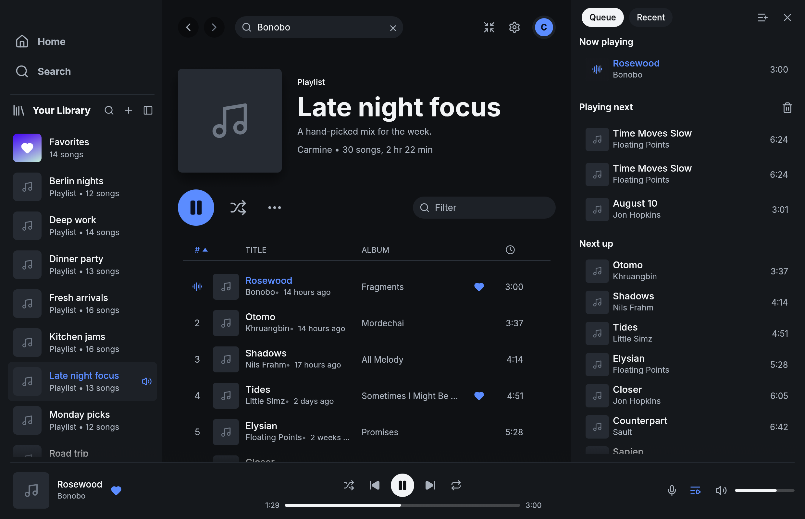

# Fastpotify

**Your music server, native and fast.** Fastpotify is a small desktop client
for [Navidrome](https://www.navidrome.org/) and compatible
[OpenSubsonic](https://opensubsonic.netlify.app/) servers. It is written in
Rust with [egui](https://github.com/emilk/egui), runs on Linux, macOS, and
Windows, and has no embedded browser engine.



See [fastpotify.rocks](https://fastpotify.rocks/) for installation, setup,
everyday use, and connection details.

## Features

- **Local playback.** Stream from the active server with play, pause, seek,
  next, previous, shuffle, repeat, volume, output-device, and buffer controls.
- **Authoritative local queue.** Manually queued songs play before the current
  album or playlist. Duplicate occurrences remain distinct, and stale stream
  or decoder work cannot roll the queue back.
- **Library and search.** Browse artists, albums, playlists, and favorites;
  search songs, artists, albums, and playlists on the server.
- **Personalized mixes.** Home cards open a daily mix weighted by listening
  frequency, favorites, genres, and artists, plus a server-backed Random mix
  that can be refreshed without interrupting playback.
- **Playlist editing.** Create, rename, describe, add/remove songs, drag rows
  into a new order, and delete. Reordering replaces the complete ordered song
  list in one OpenSubsonic request, preserving duplicate occurrences.
- **Optimistic interactions.** Playing, queueing, and favorite changes appear
  immediately while backend work catches up.
- **Album-art color**, light/dark/system themes, keyboard shortcuts, tray
  playback, and desktop media controls.
- **Winamp mini player.** Classic `.wsz` skins, spectrum analyser,
  oscilloscope, playlist, and ten-band equalizer. Visualizers receive the
  signal after EQ and before volume, so zero volume still dances.

Fastpotify intentionally does not present Navidrome Jukebox or saved play
queues as remote speaker control. The initial local pipeline does not claim
gapless playback, loudness normalization, or an on-disk audio cache.

## Install

On Arch Linux:

```sh
yay -S fastpotify-bin
```

On macOS with [Homebrew](https://brew.sh):

```sh
brew install --cask crmne/tap/fastpotify
```

Or build the repository with its pinned Rust toolchain:

```sh
cargo install --path .
```

Linux also needs the GUI and audio development packages. On Arch:

```sh
sudo pacman -S --needed alsa-lib libpulse libxkbcommon wayland
```

On Debian or Ubuntu:

```sh
sudo apt install libasound2-dev libpulse-dev libxkbcommon-dev libwayland-dev libgl1-mesa-dev
```

`nix develop` provides the repository toolchain and native dependencies.

## Connect a server

Enter the Navidrome/OpenSubsonic base URL, username, and password in the app.
Fastpotify verifies the account and server capabilities before saving it.
Use HTTPS outside a network you fully trust.

The credential lives separately from settings in the platform state
directory and is owner-only on Unix. API requests use a fresh salted token;
passwords and authenticated URLs never enter media references, artwork cache
keys, logs, or desktop-control metadata. See
[How It Connects](docs/_reference/how-it-connects.md).

## Keyboard shortcuts

| Shortcut | What it does |
| --- | --- |
| `Space` | Play or pause |
| `Ctrl+←` / `Ctrl+→` | Previous or next |
| `Shift+←` / `Shift+→` | Seek 10 seconds |
| `Ctrl+↑` / `Ctrl+↓` | Volume |
| `M` | Mute |
| `S` / `R` | Shuffle / cycle repeat |
| `Q` | Queue panel |
| `Ctrl+F` or `/` | Search |
| `Ctrl+B` | Show or hide the sidebar |
| `Alt+←` / `Alt+→` | Back or forward |
| `Ctrl+H` / `Ctrl+L` | Home / Favorites |
| `Ctrl+Shift+A` / `Ctrl+Shift+B` | Playing artist / album |
| `Ctrl+M` (`Cmd+Shift+M` on macOS) | Winamp mini player |
| `Ctrl+,` | Settings |
| `Ctrl+/` or `?` | All shortcuts |
| `Ctrl+Q` | Quit |

On macOS, Cmd replaces Ctrl where appropriate.

## Desktop control

Linux exposes MPRIS, so `playerctl --player=fastpotify play-pause` works.
On macOS and Windows, subcommands control the running instance:

```text
fastpotify play-pause          fastpotify volume 40
fastpotify play                fastpotify volume-up 10
fastpotify pause               fastpotify volume-down 10
fastpotify next                fastpotify mute
fastpotify previous            fastpotify shuffle on
fastpotify seek 15             fastpotify repeat context
fastpotify seek -- -15         fastpotify favorite
fastpotify seek-to 90          fastpotify play-ref <fastpotify:...>
fastpotify show                fastpotify now-playing --raw
```

`play-ref` and MPRIS OpenUri accept only canonical, secret-free Fastpotify
media references.

## Settings and files

Preferences remain in the existing Fastpotify application directories so an
upgrade keeps themes, layout, shortcuts, and Winamp skins. Server credentials
are in state, while artwork and lyrics are disposable caches. Session and
history files are scoped to a non-secret server/user profile fingerprint.
Settings are grouped into Account, Playback, Appearance, Winamp skins,
Equalizer, Storage, and About, with a category rail on wide windows and a
wrapped selector on compact ones.
See [Settings & Files](docs/_reference/settings-and-files.md).

## Architecture

- `src/api/`: OpenSubsonic wire DTOs, provider-neutral domain models,
  authentication, metadata, artwork, and stream requests.
- `src/player.rs`: local authoritative queue, bounded streaming, decode
  generations, and playback state.
- `src/sink.rs`, `src/eq.rs`, `src/vis.rs`: output, EQ, and the post-EQ,
  pre-volume visualizer tap.
- `src/backend.rs`: async runtime and UI channels.
- `src/app.rs`, `src/model.rs`, `src/ui/`: state, optimistic actions,
  navigation, and views.

The UI thread never performs network or playback work.

## Demo and tests

Demo mode renders deterministic sample data without connecting to a server:

```sh
cargo run --features demo -- --demo --demo-page playlist:pl1 --demo-show queue
```

`--demo-shot <PATH>` writes a screenshot. Contribution checks and product
boundaries are in [CONTRIBUTING.md](CONTRIBUTING.md).

## Acknowledgements

Fastpotify uses [egui](https://github.com/emilk/egui),
[Symphonia](https://github.com/pdeljanov/Symphonia), the
[Inter](https://rsms.me/inter/) typeface (OFL), and
[Lucide](https://lucide.dev) icons (ISC).

Licensed under the [MIT License](LICENSE).
